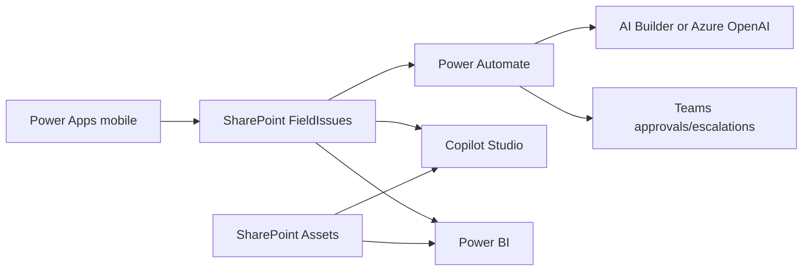

# Power Platform Field Inspection Demo Kit

A complete executive-facing demo kit for modernizing multi-county field issue intake with Power Apps, AI vision, Power Automate, Copilot Studio, SharePoint, and Power BI.

## Six-stage demo flow

1. Field employee captures a photo, GPS location, issue type, county, agency, and description in a mobile Power Apps app.
2. AI vision analyzes the photo and returns severity, conditions, recommended action, priority, confidence, and estimated cost.
3. Power Automate routes approval and assignment to the owning agency.
4. Critical public-safety issues escalate immediately to Teams and on-call channels.
5. Facilities Assistant answers operational questions over the governed SharePoint data.
6. Power BI shows executive trends, recurrence, SLA, map, agency, and cost views.

## Architecture

## Repo map

| Path | Purpose |
|---|---|
| `/datasource/sharepoint` | PnP template, idempotent list provisioning script, schema documentation |
| `/datasource/sample-data` | 120 FieldIssues rows, 40 Assets rows, import script |
| `/power-apps` | Reviewable canvas app source and packing/import instructions |
| `/ai` | AI Builder and Azure OpenAI/Copilot vision prompts, schema, examples |
| `/power-automate` | Solution-ready flow definitions and build guides |
| `/copilot-studio` | Facilities Assistant config, topics, expected responses |
| `/power-bi` | Power Query, DAX measures, TMDL stub, report build spec |
| `/demo` | Run-of-show, checklist, reset script, FAQ, architecture |
| `/index.html` | Interactive Markdown explorer for browsing and searching this kit's documentation |

## Deployment guide

1. SharePoint lists (20 min): run `/datasource/sharepoint/Provision-Lists.ps1`.
2. Sample data (5 min): run `/datasource/sample-data/Import-SampleData.ps1`.
3. Power Apps app (30-45 min): pack/import `/power-apps/FieldInspectionApp` and reconnect lists.
4. AI vision (20-40 min): configure either AI Builder prompt or Azure OpenAI prompt/schema from `/ai`.
5. Power Automate flows (45-60 min): create/import the flows in `/power-automate`.
6. Copilot Studio agent (30-45 min): follow `/copilot-studio/BUILD.md`.
7. Power BI dashboard (45-60 min): build report from `/power-bi` and publish.
8. Demo rehearsal (20 min): follow `/demo/DEMO-SCRIPT.md` and reset with `/demo/Reset-DemoData.ps1`.

See `DEPLOYMENT.md` for tenant setup, licensing, placeholders, and troubleshooting.

## Documentation explorer

Open `index.html` through a local web server or GitHub Pages to browse, render, search, and copy the Markdown files in this repo. If opened directly from disk, use the page's file picker to load Markdown files interactively.
