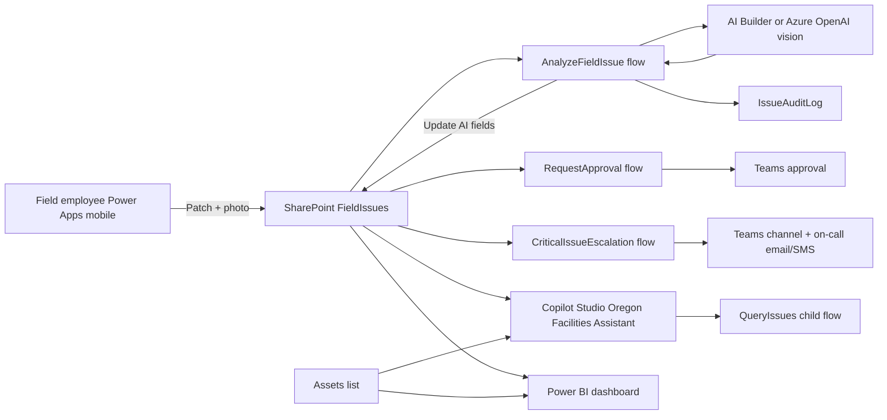

# Architecture

The demo uses SharePoint as the operational data layer, a Power Apps mobile app for intake, AI Builder or Azure OpenAI for vision analysis, Power Automate for routing/escalation/digest automation, Copilot Studio for natural-language operations, and Power BI for executive reporting.

